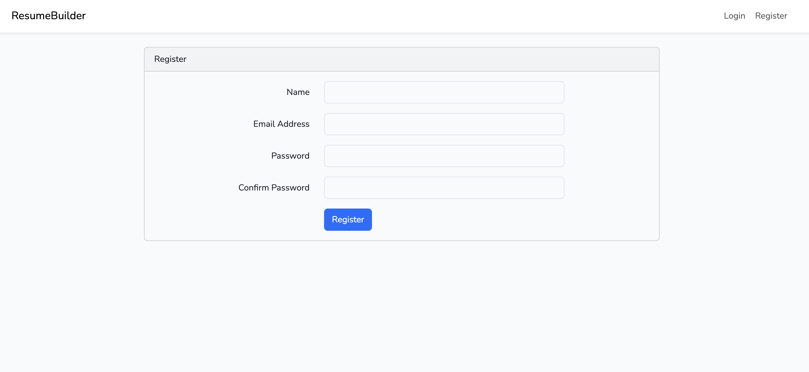
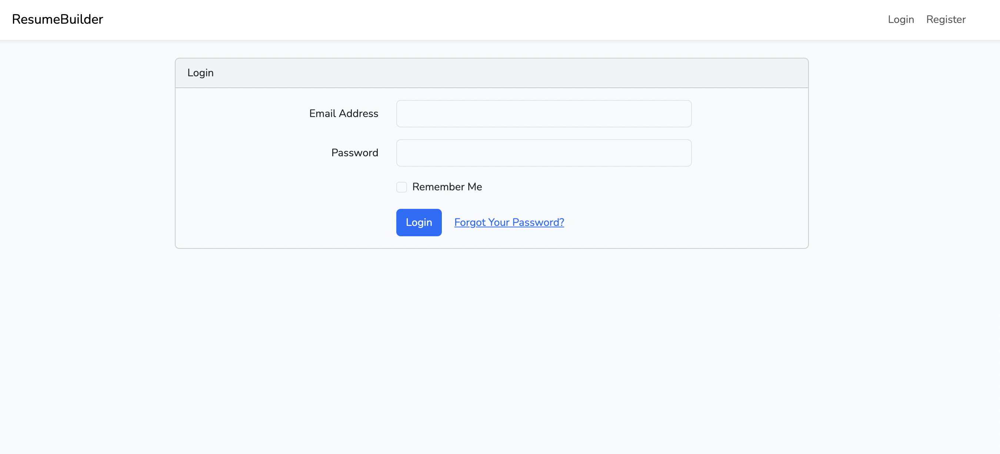
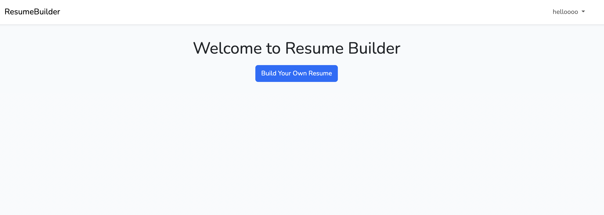
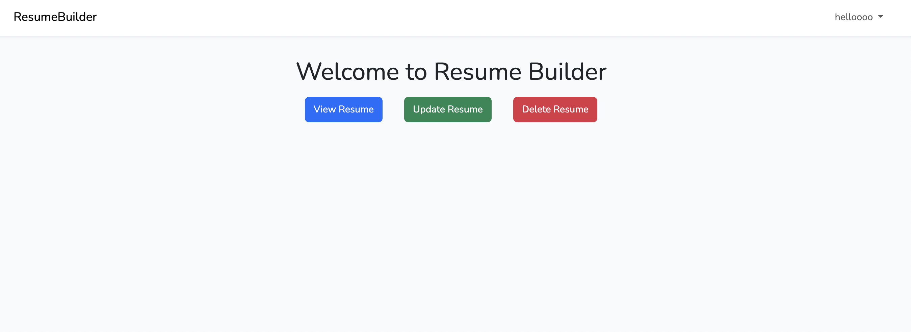
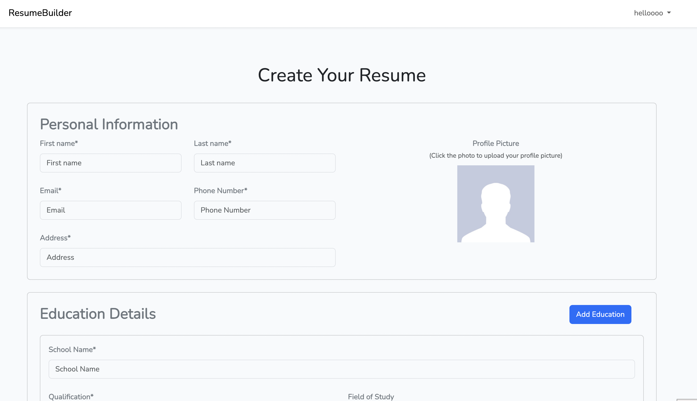
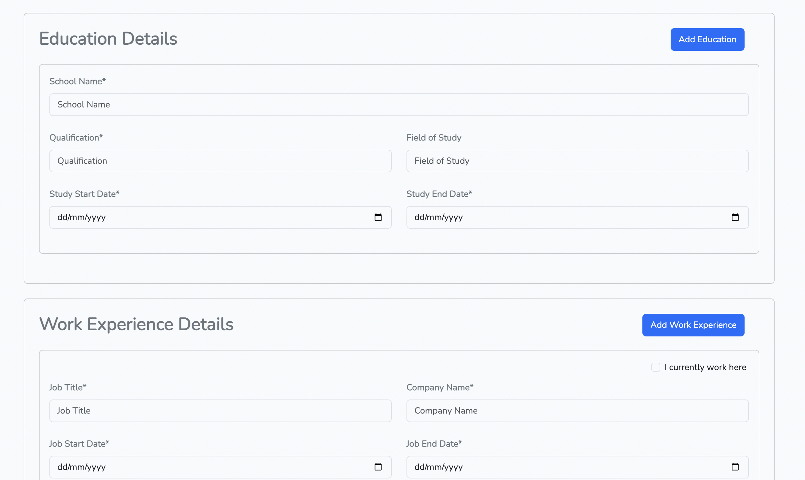
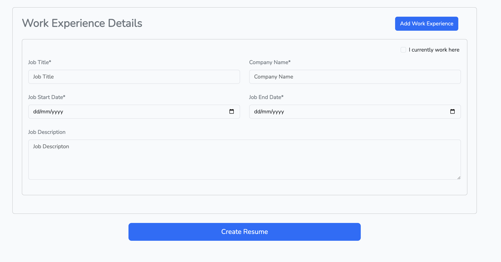
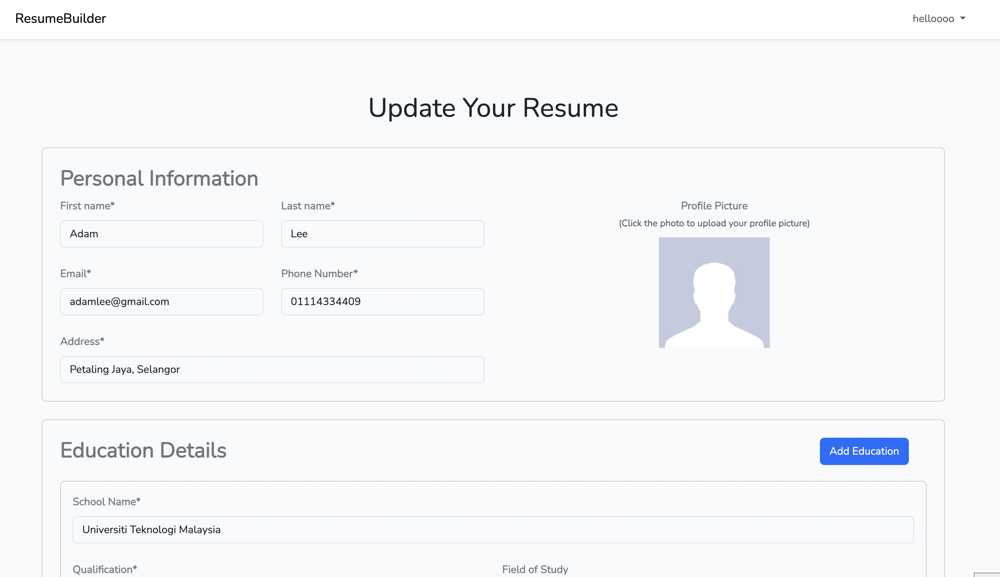
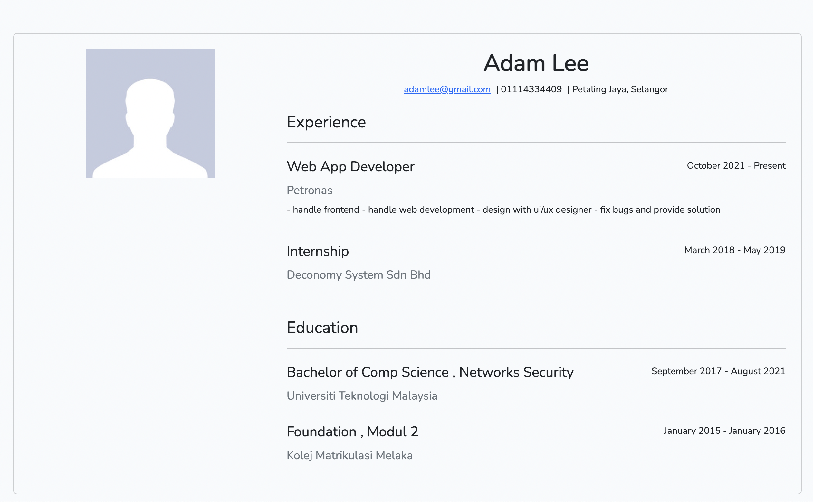

## About Resume Builder 

- User can register and sign in
- User can create a resume after they have logged in
- User can update or delete their resume
- User can view their resume and share their resume link with others

## Steps to setup Resume Builder

1. Clone this repo
2. Copy .env.example file to .env file
   
    $ cp .env.example .env

4. Run composer install

    $ composer install

5. Create new database and change the database configuration in .env file
6. Run php artisan migrate to create all tables in database
   
    $ php artisan migrate

7. Run php artisan serve to start the server
 
    $ php artisan serve

## **Screenshots of the Systems:**

### Register & Login

### Home

- when user did not add resume yet

- after user has added a resume

### Create New Resume

### Update Resume

### View Resume

